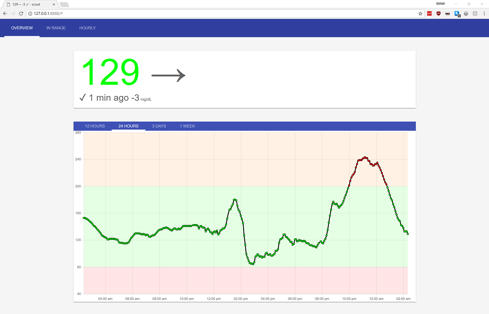
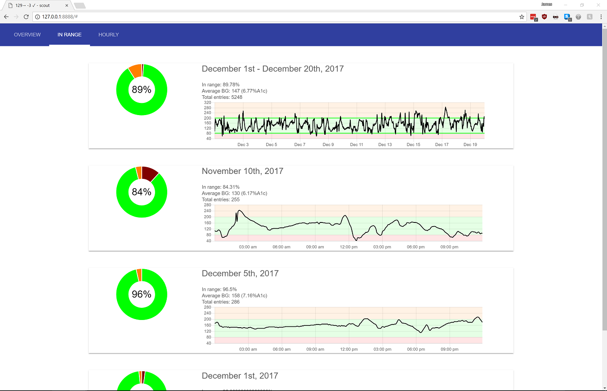

scout
=====

Scout (name subject to change) is a UI shim for viewing continuous glucose monitor data from [Nightscout](https://github.com/nightscout/cgm-remote-monitor), in a simplified and prettier form. It may grow to incorporate a backend component, but it currently only depends on cross-origin request access to the domain on which Nightscout is running.

Currently supported functionality includes:
* an overview screen, which displays the current BG reading and trend along with uploader battery and sensor age
* 12 hour, 24 hour, 3 day, and 1 week-long BG graphs on the main screen along with insulin doses
* in-range charts across one or multiple days
* the percentile BG readings across 15-minute periods over a date range
* a chart showing when the sensor has been replaced and for how long each sensor has ran, along with the average sensor age
* notifications for high and low BG readings
* custom generated favicons showing the current BG reading and trend (allows for unobtrusive use as pinned tab)

